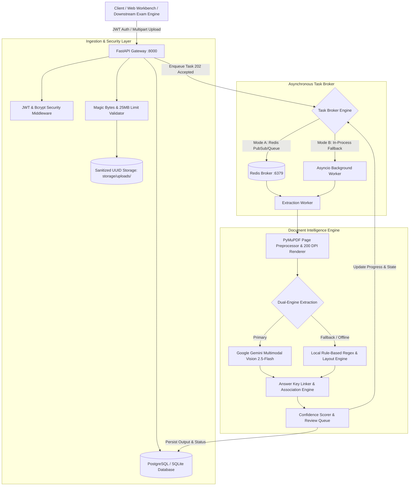

# SYSTEM ARCHITECTURE DOCUMENTATION
## Document Intelligence & Question Extraction Service
**Company / Organization:** Pragati Bharati (Round 2 — Full Stack Developer Assignment)  
**Author:** Anshuman Varma  
**Date:** September 2026

---

## 1. Overall System Architecture

The service is built as a high-concurrency, asynchronous document processing pipeline capable of converting unstructured examination papers (PDFs, scanned images, photos) into system-independent, machine-readable structured questions.

---

## 2. Document-Processing Approach

Documents arrive in diverse, imperfect formats: digitally generated PDFs, low-quality scanned pages, mobile photographs (PNG/JPG), and rotated pages.
The preprocessing pipeline (`app/core/preprocessor.py`):
1. **Format Detection & Validation**: Header magic byte analysis (`%PDF-`, `\x89PNG`, `\xff\xd8\xff`) disallows spoofed files before touching file processors.
2. **PyMuPDF Normalization**:
   - For PDFs: Renders every page into high-resolution 200 DPI RGB PNG images (`storage/extracted/{doc_id}/page_{n}.png`). High DPI ensures fine mathematical superscripts, subscripts, and table lines remain sharp for vision models.
   - Extracts digital text layers (`page.get_text("text")`) when available.
   - Preserves page geometry (`rect.width`, `rect.height`) and orientation.
   - Computes total page counts and text density.

---

## 3. OCR / AI Technology Choices & Rationale

We implement a **Dual-Engine Architecture**:

| Engine | Technology | Role & Justification |
| :--- | :--- | :--- |
| **Primary Engine** | **Google Gemini Multimodal Vision API (`gemini-2.5-flash`)** | Modern LLM vision architectures dramatically outperform legacy OCR engines (like Tesseract) on examination papers because they understand semantic context. They seamlessly handle: LaTeX math formulas ($E=mc^2$), multi-column question banks, complex tables, diagrams, handwritten answer markings, and questions split across page breaks. |
| **Fallback Engine** | **Local Rule-Based Regex & Layout Parser** | Operates without external API keys or internet connectivity. Scans digital text streams for question stems (`Q1.`, `1)`, `(i)`), options (`(A)`, `[B]`), and trailing answer keys. Guarantees 100% test suite determinism and offline evaluation capability. |

---

## 4. Storage Design & Database Schema

The database persistence layer complies with the **PostgreSQL** requirement and utilizes SQLAlchemy 2.0 with Alembic migrations:

### Tables & Relationships:
1. **`users`**:
   - `id` (PK, Int), `email` (Unique, Index), `hashed_password` (Bcrypt), `role`, `is_active`, `created_at`.
2. **`documents`**:
   - `id` (PK, UUID String), `user_id` (FK -> users.id), `filename`, `original_filename`, `file_type`, `file_size_bytes`, `storage_path`, `role` (`QUESTION_PAPER`, `ANSWER_KEY`, `COMBINED`), `status` (`QUEUED`, `PROCESSING`, `COMPLETED`, `FAILED`), `progress` (0-100), `total_pages`, `metadata_json` (JSONB).
3. **`questions`**:
   - `id` (PK, UUID String), `document_id` (FK -> documents.id), `question_number`, `question_text` (Text), `question_type` (`multiple_choice`, `multi_select`, `numerical`, `short_answer`), `options` (JSONB list of `[{label, text}]`), `answer` (String), `confidence_score` (Float 0.0-1.0), `review_required` (Boolean, Index), `review_reasons` (JSONB array), `source_pages` (JSONB array e.g. `[1, 2]`), `has_diagram_or_table` (Boolean).
4. **`document_relationships`**:
   - `id` (PK), `parent_document_id` (FK -> documents.id), `related_document_id` (FK -> documents.id), `relation_type` (`ANSWER_KEY_FOR`, `SUPPLEMENT_TO`).
5. **`answer_keys`**:
   - `id` (PK), `document_id` (FK -> documents.id), `raw_key_data` (JSONB), `detection_confidence`, `is_associated`.

---

## 5. Asynchronous Processing & State Machine

Uploading large multipage PDFs (e.g. 50 pages) would freeze synchronous HTTP clients. 
We decouple ingestion from extraction:
- Ingestion endpoint returns `202 Accepted` immediately with initial document ID and `QUEUED` state.
- **Dual Task Broker**:
  - In production with Docker: Dispatches jobs to Redis (`queue:document_extraction`) and tracks state.
  - In local evaluation: Automatically falls back to an async in-process background worker (`asyncio.create_task`) without requiring external Redis installation.
- **Lifecycle States**:
  `QUEUED (0%)` &rarr; `PREPROCESSING (40%)` &rarr; `EXTRACTION (80%)` &rarr; `COMPLETED (100%)` (or `FAILED` with explicit `error_message`).
- Polling via `GET /api/v1/documents/{id}/status`.

---

## 6. Question Extraction & Cross-Page Stitching Strategy

### Problem:
A question starts at the bottom of Page 1 and its options appear at the top of Page 2. Legacy parsers split this into two garbage fragments.

### Solution:
1. The Vision Engine receives all sequential page images together with strict instructions to correlate stem beginnings with choice continuations.
2. The Local Engine maintains an active question buffer (`pending_question`). If Page 2 begins with option labels (`(C)`, `(D)`) without a preceding question number, it appends those options to the pending question on Page 1, marks `source_pages = [1, 2]`, and flags `CROSS_PAGE_CONTINUATION`.

---

## 7. Answer Key Association Engine

The assignment requires associating answers whether located at the beginning, end, or in a completely separate file:
1. **Embedded Answer Keys**: Detected automatically via section pattern matching (`ANSWER KEY: 1. A, 2. B...`). Extracted keys are mapped to corresponding questions.
2. **Decoupled Answer Key Documents**:
   - Evaluator uploads `Question_Paper.pdf` and `Answer_Key.pdf` separately.
   - Invoking `POST /api/v1/documents/{id}/associate-answer-key` links the two documents via `document_relationships`.
   - The engine iterates through the questions of the question paper, matches question numbers from the answer key, assigns answers, and recalculates confidence.
3. **Uncertainty Guardrail**: If an answer cannot be verified with certainty, the system strictly assigns `answer: null` and flags `review_required: true` with `review_reasons: ["UNMATCHED_ANSWER"]` rather than silently hallucinating an incorrect answer (Assignment Section 4 rule).

---

## 8. Confidence Scoring & Human Review Mechanism

Every extracted question is evaluated by `ConfidenceScorer` (`app/services/confidence_service.py`):
- **Checks applied**:
  - `MISSING_ALL_OPTIONS`: MCQ without choices (Penalty: -0.35)
  - `MISSING_OPTION_X`: Fewer than 4 choices in MCQ (Penalty: -0.20)
  - `UNMATCHED_ANSWER`: Question without identified answer (Penalty: -0.15)
  - `UNCERTAIN_ANSWER_MISMATCH`: Answer key letter does not match available options (Penalty: -0.25)
  - `CROSS_PAGE_CONTINUATION`: Spans page boundary (Flagged for verification)
  - `SUSPICIOUSLY_SHORT_QUESTION_TEXT`: Text < 15 characters (Penalty: -0.20)
- Questions with confidence < 0.85 or explicit flags are surfaced in the **Review Queue** (`GET /api/v1/documents/{id}/review-items`).
- Human reviewers can verify, edit, and approve items via `PATCH /api/v1/documents/{id}/questions/{q_id}`.

---

## 9. Security & Guardrails

1. **Authentication**: JWT tokens (OAuth2 Bearer) with 12-round bcrypt password hashing.
2. **MIME Type Spoofing Defense**: Header magic bytes inspection ensures executable or script files disguised as `.pdf` are rejected with HTTP 400.
3. **Path Traversal Protection**: Filenames are sanitized and prepended with random UUIDs (`{uuid}_{sanitized_name}`).
4. **Tenant Isolation**: Every database query filters by `user_id == current_user.id`.
5. **Credential Safety**: Secrets and API keys are strictly loaded via `.env` and `pydantic-settings`.

---

## 10. Scalability Considerations & Production Readiness

1. **Horizontal Worker Scaling**: In production, the worker process (`worker.py`) can be replicated across multiple Kubernetes pods or Docker containers consuming from Redis.
2. **Object Storage Offload**: Local storage paths can be replaced with S3/GCS buckets using MinIO or boto3.
3. **Database Read Replicas**: High-frequency status polling endpoints can read from PostgreSQL read replicas.
4. **Rate Limiting**: Can be added via Redis token-bucket middleware.

---

## 11. Important Trade-Offs & Limitations

- **Trade-off: High-Resolution Rendering vs Processing Speed**: Rendering pages at 200 DPI adds ~200ms per page but prevents OCR degradation on complex equations.
- **Limitation: Free-form Subjective Grading**: Subjective questions (essay-type) cannot be auto-graded without rubric-based grading models; they are tagged as `short_answer` with `UNMATCHED_ANSWER` flag for manual scoring.
