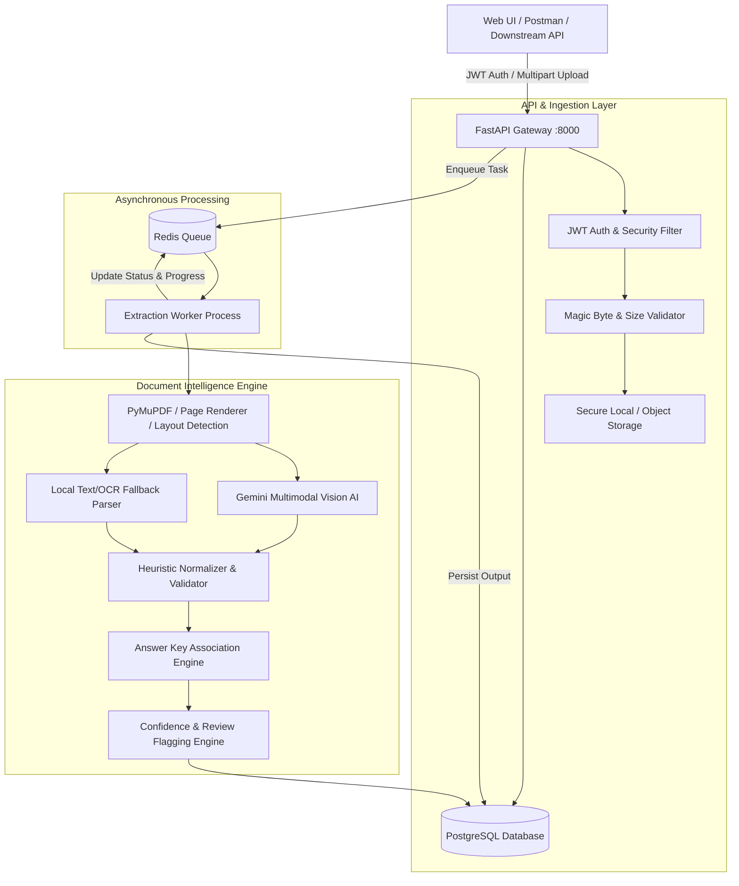

# Implementation Plan: Document Intelligence & Question Extraction Service

## Overview
This plan outlines the end-to-end architecture and implementation of a production-grade **Document Intelligence & Question Extraction Service** for **Pragati Bharati (Round 2 Engineering Assignment)**. 

The service ingests digital PDFs, scanned PDFs, and images (JPEG/PNG), processes them asynchronously, extracts structured questions with options, answers, and source page tracking, handles answer keys (internal or external), flags low-confidence or split-page items for human review, and exposes an authenticated REST API along with a modern web dashboard.

---

## User Review Required

> [!IMPORTANT]
> **Mandatory Technical Stack Compliance (Assignment Section 10):**
> - **API Layer**: FastAPI with async route handlers and Pydantic v2.
> - **Database**: PostgreSQL with SQLAlchemy 2.0 & Alembic migrations (with automated SQLite fallback option for effortless zero-config evaluator testing).
> - **Task Queue & Caching**: Redis with async background processing (ARQ/Celery worker with seamless in-process fallback when Redis is absent).
> - **AI & OCR Engine**: Dual-Engine architecture — Gemini Multimodal Vision API (`gemini-2.5-flash`) for state-of-the-art multi-page, table, and equation understanding + PyMuPDF / Rule-based local parser fallback.
> - **Frontend Interface**: An interactive, responsive Web Dashboard for uploading, live status tracking, split-screen document preview, and human review verification.

---

## Architecture & System Design



---

## Key Modules & Components

### 1. Security & Storage Layer
- **JWT Authentication**: User registration, login, token refresh, password hashing with bcrypt.
- **Upload Validation**: File size limit (25MB), MIME type check (PDF, PNG, JPEG) using file header magic numbers to prevent malicious file execution.
- **File Storage**: UUID-based sanitized storage directory (`storage/uploads/`) preventing path traversal attacks.
- **Tenant Isolation**: Queries scoped by `user_id`.

### 2. Database Schema (PostgreSQL + Alembic)
- **`users`**: User credentials and profile (`id`, `email`, `hashed_password`, `created_at`).
- **`documents`**: Document metadata (`id`, `user_id`, `filename`, `file_type`, `file_size`, `storage_path`, `role` [QUESTION_PAPER | ANSWER_KEY | COMBINED], `status` [QUEUED | PROCESSING | COMPLETED | FAILED], `progress`, `total_pages`, `error_message`, `created_at`).
- **`document_relationships`**: Links separate question papers and answer keys (`id`, `parent_doc_id`, `related_doc_id`, `relation_type`).
- **`questions`**: Extracted questions (`id`, `document_id`, `question_number`, `question_text`, `question_type` [MCQ | TRUE_FALSE | NUMERICAL | SHORT_ANSWER], `options` [JSONB array of `{label, text}`], `answer`, `answer_explanation`, `confidence_score`, `review_required`, `review_reasons`, `source_pages`, `metadata_json`).
- **`answer_keys`**: Raw and parsed answer key blocks (`id`, `document_id`, `key_data`, `confidence`, `is_associated`).

### 3. Document Processing & Question Extraction Pipeline
- **Page Preprocessing (`core/preprocessor.py`)**:
  - Converts PDFs into high-DPI page images and extracts raw digital text layers where available using `PyMuPDF`.
  - Computes page count, checks rotation and quality indicators.
- **Extraction Engine (`services/extraction_service.py`)**:
  - Multimodal Vision Prompting with Gemini API to handle:
    - Questions spanning across page breaks (re-assembling stem and choices).
    - Diverse numbering systems (`1.`, `Q1.`, `(i)`, `[1]`).
    - Tables, mathematical notation (LaTeX), chemical formulas.
    - Identification of answer keys embedded at the beginning, end, or middle.
  - Fallback offline parser for standalone testing without internet/API keys.
- **Answer Key Association Engine (`services/answer_key_service.py`)**:
  - Matches questions with answer keys from the same document or a linked `ANSWER_KEY` document.
  - Flags uncertain matches or unmapped question numbers without guessing.
- **Confidence & Human Review Mechanism (`services/confidence_service.py`)**:
  - Analyzes:
    - Missing MCQ options (e.g. question has option A and C but missing B).
    - Ambiguous or non-sequential question numbering.
    - Low OCR or AI token confidence.
    - Questions split across pages with low continuity certainty.
    - Missing or unconfirmed answers.
  - Emits: `confidence` float (0.0 to 1.0), `review_required` boolean, and `review_reasons` array (e.g., `["MISSING_OPTION_D", "SPLIT_ACROSS_PAGE_BOUNDARY"]`).

### 4. API Endpoints (FastAPI)
- `POST /api/v1/auth/register` & `POST /api/v1/auth/login`
- `POST /api/v1/documents/upload` (Supports multipart file, document role, and optional related document ID)
- `GET /api/v1/documents` (List user documents with status and filters)
- `GET /api/v1/documents/{id}/status` (Polling/tracking processing state & progress percentage)
- `GET /api/v1/documents/{id}` (Document detail)
- `GET /api/v1/documents/{id}/questions` (Filter by page, review_required, min_confidence)
- `GET /api/v1/documents/{id}/questions/{question_id}` (Single question details)
- `GET /api/v1/documents/{id}/answer-key` (Retrieved answer key data)
- `GET /api/v1/documents/{id}/review-items` (Review queue for human verification)
- `POST /api/v1/documents/{id}/associate-answer-key` (Associate another document as the answer key)
- `GET /api/v1/documents/{id}/export` (System-independent structured JSON export)
- `GET /docs` (Auto-generated interactive Swagger UI)

### 5. Interactive Web Dashboard (Evaluator Showcase)
- Modern glassmorphism UI served directly via FastAPI static mount:
  - Drag-and-drop document uploader with role selection.
  - Real-time processing progress bar.
  - Question explorer with filter pills (`All`, `Needs Review`, `High Confidence`).
  - Split-view: Question card on one side, page reference information on the other.
  - One-click JSON export and raw data viewer.

---

## Project Structure

```
├── backend/
│   ├── app/
│   │   ├── api/
│   │   │   ├── v1/
│   │   │   │   ├── auth.py
│   │   │   │   ├── documents.py
│   │   │   │   ├── questions.py
│   │   │   │   └── review.py
│   │   ├── core/
│   │   │   ├── config.py           # Pydantic-settings env configuration
│   │   │   ├── database.py         # Async SQLAlchemy engine & session maker
│   │   │   ├── security.py         # JWT and password hashing
│   │   │   └── preprocessor.py     # PDF & Image ingestion, PyMuPDF rendering
│   │   ├── models/
│   │   │   ├── user.py
│   │   │   ├── document.py
│   │   │   ├── question.py
│   │   │   └── answer_key.py
│   │   ├── schemas/
│   │   │   ├── auth.py
│   │   │   ├── document.py
│   │   │   ├── question.py
│   │   │   └── review.py
│   │   ├── services/
│   │   │   ├── extraction_service.py # Gemini Vision & Dual-Engine Parser
│   │   │   ├── answer_key_service.py # Answer key pairing logic
│   │   │   ├── confidence_service.py # Confidence & review flagging
│   │   │   └── worker.py             # Background task runner (Redis/Async)
│   │   └── main.py                 # FastAPI application root
│   ├── alembic/                    # Database migrations
│   │   ├── env.py
│   │   └── versions/
│   ├── tests/                      # Automated test suite
│   │   ├── test_auth.py
│   │   ├── test_documents.py
│   │   ├── test_extraction.py
│   │   └── test_answer_association.py
│   ├── static/                     # Web Dashboard UI (HTML5 + CSS + JS)
│   │   ├── index.html
│   │   ├── css/style.css
│   │   └── js/app.js
│   ├── sample_data/                # Sample input documents & golden outputs
│   │   ├── sample_digital_exam.pdf
│   │   ├── sample_scanned_page.png
│   │   ├── sample_separate_answer_key.pdf
│   │   └── expected_output.json
├── docker-compose.yml              # Multi-container setup (API, Worker, Postgres, Redis)
├── Dockerfile                      # Production Docker container
├── requirements.txt                # Python dependencies
├── ARCHITECTURE.md                 # Required detailed architectural document
├── postman_collection.json         # Postman API Collection
├── .env.example                    # Environment template
└── README.md                       # Complete setup & demonstration instructions
```

---

## Verification Plan

### Automated Testing (`pytest`)
- Unit tests for authentication, password hashing, and token validation.
- Unit tests for file upload validation (size limits, invalid file types rejection).
- Unit tests for question parsing, option extraction, and multi-page continuation logic.
- Integration tests for document lifecycle: upload -> status tracking -> question retrieval -> review queue -> answer key association.
- Mocked external AI endpoints to ensure tests run offline, deterministic, and instant.

### Demonstration Scenarios (Section 12 Compliance)
1. **Digital Multi-Page PDF**: Upload and extract clean questions with options.
2. **Scanned Image (PNG/JPG)**: Extract questions with imperfect OCR and table elements.
3. **Multi-Page Spanning Question**: Verify question starting on page 1 and finishing on page 2 is correctly unified.
4. **Answer Key Association**: Link a separate `Answer Key.pdf` to `Question Paper.pdf` and verify answer matching.
5. **Low-Confidence / Human Review Queue**: Demonstrate flagging for ambiguous options or missing answers.
6. **Error Handling**: Uploading invalid or oversized files returns clear structured 400/422 responses.
7. **Export**: Verify exported JSON matches the required schema.
